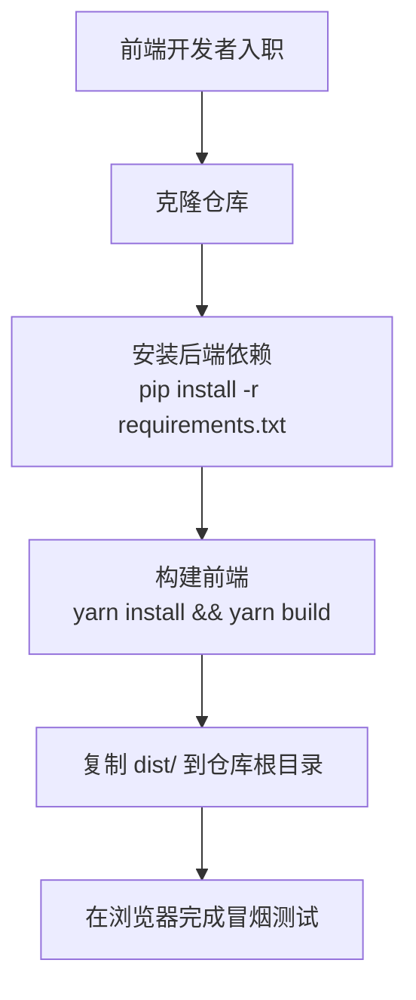
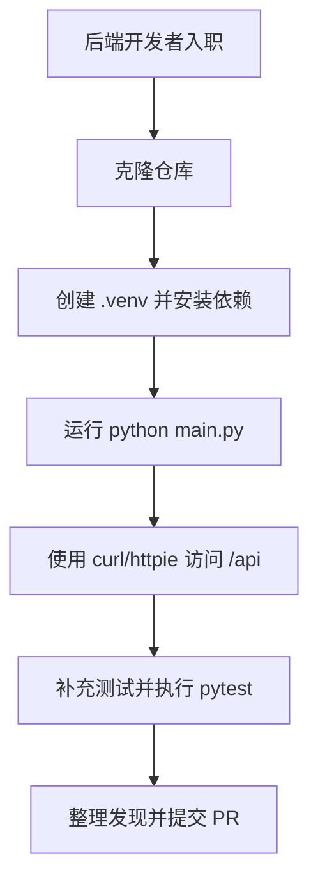

# 仓库指南

## 项目结构与模块
- `main.py` 负责使用 `pkg/*` 配置与日志启动 FastAPI，并加载 `app.py` 中定义的应用。
- `routes/` 存放核心路由（`admin.py`、`session.py`、`object.py`、`site.py`），新增模块后请在 `app.py` 注册。
- `model/` 汇集 SQLModel 表、数据库工具与响应模型；共享字段请复用 `model/base/` 混入。
- `middleware/` 管理认证与限流；公共工具位于 `pkg/`；Vue 构建产物保存在 `dist/`，视觉资产位于 `docs/`。

## 构建、测试与开发
- 创建虚拟环境（`python -m venv .venv`）并激活，随后执行 `pip install -r requirements.txt`。
- 通过 `python main.py` 启动后端；流程会生成 `.env`、初始化 SQLite `data.db`，`DEBUG=true` 时开启热重载。
- 在前端仓库运行 `yarn install && yarn build`，将生成的 `dist/` 拷贝回项目根目录并刷新服务。
- 使用 `pytest` 执行自动化检查；重构期间可通过 `-k` 聚焦相关用例。

## 入职流程

## 编码风格与命名
- 统一使用 Python 3.13+、四空格缩进，并在公共接口添加类型注解；仅对复杂逻辑补充文档字符串。
- 函数使用 `snake_case`，数据模型使用 `PascalCase`，配置与日志归于 `pkg/`（`pkg/logger.py` 封装`loguru`）。
- 所有代码、注释、提交信息与评审讨论均使用简体中文。

## 测试规范
- 在 `tests/` 中镜像业务目录（如 `tests/test_session.py`），以 `test_<行为>()` 命名测试函数。
- 通过 `pytest` fixture 启动临时 SQLite 数据库，并在 PR 中说明手工验证或覆盖率缺口。

## 提交与 Pull Request
- 提交信息保持简洁的祈使句（例如 `新增通知发送器`），仅在必要时补充作用域。
- PR 需关联议题、突出模型或接口变更、列出迁移与测试结果，并附上影响界面的截图或 `curl` 示例。

## 安全与配置提示
- 机密数据仅存放于 `.env`；依赖 `pkg/env.ensure_env_file()` 生成默认值，勿直接修改源代码。
- 调整 `middleware/` 或 `routes/` 后须复验认证流程与 SlowAPI 限流，确保防护完整。